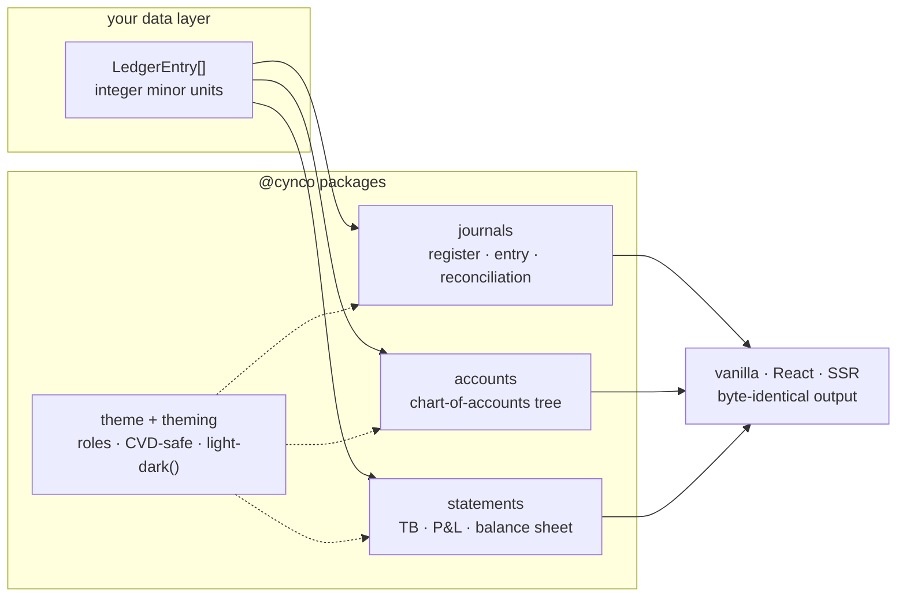

<div align="center">

# CYNCO █

**Modern accounting infrastructure for TypeScript.**

Ledger UI components that treat money like a compiler treats source: exact, verified, never silently repaired.

[](https://github.com/hazlijohar95/cynco-oss/actions/workflows/ci.yml)
[](https://www.npmjs.com/package/@cynco/journals)
[](LICENSE.md)
[](tsconfig.json)

[**ledger.cynco.dev**](https://ledger.cynco.dev) · [Docs](https://ledger.cynco.dev/docs/journals) · [Playground](https://ledger.cynco.dev/playground) · [Perf lab — 1M entries, live](https://ledger.cynco.dev/ledger-dev) · [llms.txt](https://ledger.cynco.dev/llms.txt)

<a href="https://ledger.cynco.dev"></a>

</div>

---

## The invariants

Everything in this repo holds three lines, everywhere, with no exceptions:

```
1. Every amount is an INTEGER MINOR UNIT.  No floats ever touch money.
2. Every journal entry BALANCES — or is flagged inline, never repaired.
3. SSR, worker, and client render BYTE-IDENTICAL HTML.
```

## Quickstart

```bash
pnpm add @cynco/journals @cynco/accounts
```

```tsx
import { Register } from '@cynco/journals/react';

// One posting line of a register. Amounts are integer minor units:
// 125_000 = RM 1,250.00. Positive = debit, negative = credit.
const rows = [
  {
    entry: {
      id: 'e1',
      date: '2026-07-21',
      flag: 'cleared',
      payee: 'Maybank',
      narration: 'Client payment',
      tags: [],
      links: [],
      postings: [
        { account: 'Assets:Current:Cash-Maybank', amount: 125_000, currency: 'MYR' },
        { account: 'Income:Consulting', amount: -125_000, currency: 'MYR' },
      ],
    },
    posting: { account: 'Assets:Current:Cash-Maybank', amount: 125_000, currency: 'MYR' },
    runningBalance: new Map([['MYR', 125_000]]),
  },
];

<Register rows={rows} options={{ account: 'Assets:Current:Cash-Maybank' }} />;
```

Vanilla, no framework:

```ts
import { JournalEntry } from '@cynco/journals';

new JournalEntry({ showLineNumbers: true }).render({
  entry: ledgerEntry,
  parentNode: document.body,
});
```

Server-side rendering (declarative shadow DOM, zero-write hydration):

```ts
import { preloadJournalEntryHTML } from '@cynco/journals/ssr';

const html = await preloadJournalEntryHTML(ledgerEntry);
```

## Packages

| Package | | What it is |
| --- | --- | --- |
| [`@cynco/ledger-core`](packages/ledger-core) | [](https://www.npmjs.com/package/@cynco/ledger-core) | The engine: double-entry data model, integer minor-unit money kernel, entry/account stores, statement derivations. Everything below builds on it. |
| [`@cynco/journals`](packages/journals) | [](https://www.npmjs.com/package/@cynco/journals) | Journal entries, virtualized registers, reconciliation, entry streaming. The diff library of ledgers. |
| [`@cynco/accounts`](packages/accounts) | [](https://www.npmjs.com/package/@cynco/accounts) | The chart of accounts as a path-first virtualized tree with per-account balances. |
| [`@cynco/statements`](packages/statements) | [](https://www.npmjs.com/package/@cynco/statements) | Trial balance, income statement, and balance sheet renderers derived from entries. |
| [`@cynco/importers`](packages/importers) | [](https://www.npmjs.com/package/@cynco/importers) | Bank statement parsers (CSV, OFX) producing reconciliation-ready lines and balanced draft entries. |
| [`@cynco/theming`](packages/theming) | [](https://www.npmjs.com/package/@cynco/theming) | Runtime theme controller — light / dark / system, persistence, React bindings. |
| [`@cynco/theme`](packages/theme) | [](https://www.npmjs.com/package/@cynco/theme) | Palettes and semantic roles for ledger UIs, including CVD-safe sets. |

Every rendering package ships vanilla web components, React adapters (`/react`), and SSR preloaders (`/ssr`) from one codebase; `@cynco/ledger-core` and `@cynco/importers` are pure data — no DOM, no framework.



## Engineering

The parts that make it feel the way it feels:

- **Critically-damped spring scrolling** — `scrollToRow` / `scrollToDate` / `scrollToSection` glide on a closed-form ODE (~440 ms settle). Retargeting preserves velocity; any user input cancels instantly; `prefers-reduced-motion` always jumps.
- **Arithmetic virtualization** — fixed-height windowing with prefix-sum offsets. Same DOM node count at 100 rows or 1,000,000. No layout reads before a scroll.
- **Keyed row reconciliation** — window commits reuse live DOM elements, so state changes actually transition and reconciliation verdicts dissolve instead of popping.
- **Worker pool with byte-identical fallback** — window rendering and match proposals run off the main thread; a dead worker degrades performance, never correctness.
- **Deterministic reconciliation engine** — exact, date-window, and multi-posting sum passes; accept / reject / undo. Merge-conflict UI for bank reconciliation.
- **Shadow DOM isolation** — components can't leak styles in or out. Light and dark from one DOM via `light-dark()`; every color is a themable token with an override chain.
- **Accessibility as a feature** — full keyboard grids, `aria-activedescendant` honesty, IME guards, live-region discipline, touch-visible affordances, CVD-safe theme sets verified post-simulation.

Numbers and methodology: [PERFORMANCE.md](PERFORMANCE.md) · live: [the perf lab](https://ledger.cynco.dev/ledger-dev).

## Development

```bash
git clone https://github.com/hazlijohar95/cynco-oss && cd cynco-oss
pnpm install
pnpm exec moon run :test        # everything, affected-aware
pnpm exec moon run docs:dev     # the docs site locally
```

Full setup, conventions, and the task graph: [CONTRIBUTING.md](CONTRIBUTING.md) · [TESTING.md](TESTING.md) · [AGENTS.md](AGENTS.md) (yes, agents are first-class contributors here — there's an [llms.txt](https://ledger.cynco.dev/llms.txt)).

## License

MIT © [Cynco](https://cynco.dev). Palette ramps derived from `@pierre/theme` (MIT) by The Pierre Computer Company. Site and demos are set in [Paper Mono](https://github.com/paper-design/paper-mono) (SIL OFL 1.1); the packages bundle no font — set `--journals-font-family` / `--accounts-font-family` to match your stack.
